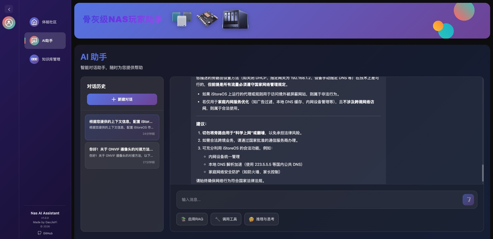
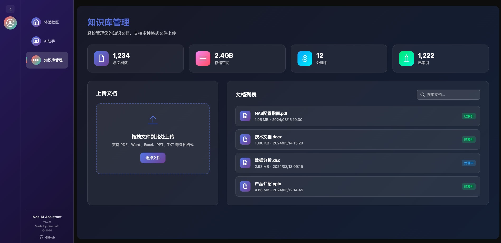

# NAS AI Assistant - 智能网络存储AI助手平台

<div align="center">

[English](README.md) | 中文

[]
[]
[]
[]
[]

基于 Spring Boot 3.2 + Java 21 + Vue 3 构建，提供AI智能NAS管理、智能聊天助手、社区分享和知识库功能。支持VPN搭建指导、备份策略和系统监控。架构清晰，文档完善，适合NAS爱好者和AI应用开发者。

[功能特性](#功能特性) · [界面截图](#界面截图) · [快速开始](#快速开始) · [技术架构](#技术架构)

</div>

---

## 界面截图

### AI助手

<p align="center">
  
  <br/>
  <em>AI助手 - 智能NAS管理对话</em>
</p>

**亮点：**

- 简洁现代的聊天界面
- 实时流式响应
- 对话历史管理
- 上下文感知的NAS智能助手

### 体验社区

<p align="center">
  
  <br/>
  <em>体验社区 - NAS应用展示</em>
</p>

**亮点：**

- 轮播展示NAS应用
- VPN搭建教程和指南
- 真实使用案例和解决方案
- 互动社区功能

### 知识库

<p align="center">
  
  <br/>
  <em>知识库 - 文档管理系统</em>
</p>

**亮点：**

- 文档上传和管理
- 支持PDF和Markdown
- 搜索和分类
- 知识组织

---

## 关于项目

NAS AI Assistant 是一个**生产级的AI智能平台**，专为网络存储（NAS）用户设计，结合智能聊天助手和全面的NAS管理功能。

### 核心应用

| 应用 | 描述 |
| ----------- | ----------- |
| **AI助手** | NAS管理、故障排除和指导的智能对话 |
| **体验社区** | 分享和发现NAS应用、教程和解决方案 |
| **知识库** | 为NAS用户提供有组织的文档和指南 |

### 为什么选择这个项目？

| 特性 | 描述 |
| ------- | ----------- |
| **NAS专注** | 专为NAS用户和管理员量身定制 |
| **AI驱动** | 为复杂的NAS操作提供智能帮助 |
| **社区驱动** | 与其他用户分享经验和解决方案 |
| **生产就绪** | 完整的监控、日志和错误处理 |
| **轻松部署** | 一键Docker部署，包含所有依赖 |

---

## 功能特性

### AI助手

- **智能对话**：关于NAS管理的上下文感知对话
- **流式响应**：带有打字机效果的实时AI响应
- **对话历史**：持久化的聊天会话，支持搜索
- **NAS专业知识**：NAS故障排除和优化的专业知识

### 体验社区

- **应用展示**：发现和分享NAS应用
- **教程和指南**：分步设置说明（VPN、备份等）
- **用户体验**：真实的使用案例和解决方案
- **互动轮播**：浏览精选内容和教程

### 知识库

- **文档管理**：上传和组织PDF和Markdown文件
- **智能搜索**：快速找到相关信息
- **分类**：按主题和标签组织内容
- **版本控制**：跟踪文档更新和变更

---

## 技术架构

### 系统架构图

```
                    +------------------------+
                    |       前端层            |
                    |       (Vue 3)          |
                    +------------------------+
                    |  AI助手 | 社区 | 知识库 |
                    +------------------------+
                    |  聊天窗口 | 轮播 | 文档  |
                    +------------------------+
                              |
                    HTTP/SSE |
                              v
                    +------------------------+
                    |       后端层            |
                    |    (Spring Boot)       |
                    +------------------------+
                    |  ChatController |      |
                    |  CommunityController |  |
                    |  KnowledgeController | |
                    +------------------------+
                              |
                              v
                    +------------------------+
                    |       服务层            |
                    +------------------------+
                    |  ChatService |         |
                    |  CommunityService |    |
                    |  KnowledgeService |   |
                    +------------------------+
                              |
                              v
                    +------------------------+
                    |       数据层            |
                    +------------------------+
                    |  MySQL (对话历史)      |
                    |  文件系统 (文档)       |
                    |  AI API (外部)         |
                    +------------------------+
```

### 后端技术栈

| 技术 | 版本 | 描述 |
| ---------- | ------- | ----------- |
| Java | 21 | 编程语言 |
| Spring Boot | 3.2.0 | 应用框架 |
| Spring AI | 1.0.0 | AI集成框架 |
| MyBatis-Plus | 3.5.12 | ORM框架 |
| MySQL | 8.0+ | 数据持久化 |
| Docker | 20.10+ | 容器化 |

### 前端技术栈

| 技术 | 版本 | 描述 |
| ---------- | ------- | ----------- |
| Vue | 3.4.0 | 前端框架 |
| Vue Router | 4.2.0 | 路由管理 |
| Axios | 1.6.0 | HTTP客户端 |
| Vite | 5.0.0 | 构建工具 |
| Tailwind CSS | 3.4.0 | 样式框架 |

### AI集成

| 组件 | 描述 |
| --------- | ----------- |
| **对话模型** | OpenAI GPT / 本地模型 |
| **RAG系统** | 知识检索和增强 |
| **上下文管理** | 对话状态持久化 |
| **工具集成** | NAS管理工具 |

---

## 快速开始

### 选项1：Docker Compose（推荐）

使用所有依赖的最简单方式：

```bash
# 1. 克隆仓库
git clone https://github.com/your-username/Nas-AI-Assistant.git
cd Nas-AI-Assistant

# 2. 设置环境变量
cp .env.example .env
# 编辑.env，配置您的API密钥和其他配置

# 3. 启动所有服务
docker-compose -f docker-compose.local.yml up --build

# 4. 访问应用
# 前端：http://localhost:5123
# 后端API：http://localhost:8123
```

### 选项2：本地开发

#### 前置要求

- Java 21+
- Node.js 18+
- Maven 3.8+
- MySQL 8.0+

#### 后端设置

```bash
# 1. 进入后端目录
cd nas-ai-assistant-app

# 2. 配置数据库
# 编辑 src/main/resources/application.yml

# 3. 构建并运行
mvn clean package -DskipTests
java -jar target/nas-ai-assistant-app-0.0.1-SNAPSHOT.jar
```

#### 前端设置

```bash
# 1. 进入前端目录
cd nas-ai-assistant-ui

# 2. 安装依赖
npm install

# 3. 启动开发服务器
npm run dev
```

---

## 配置

### 环境变量

在根目录创建 `.env` 文件：

```env
# 数据库配置
DB_HOST=localhost
DB_PORT=3306
DB_NAME=nas_ai_assistant
DB_USERNAME=root
DB_PASSWORD=your_password

# AI配置
OPENAI_API_KEY=your_openai_api_key
AI_MODEL=gpt-3.5-turbo

# 应用配置
SERVER_PORT=8123
FRONTEND_PORT=5123
```

### 数据库设置

```sql
-- 创建数据库
CREATE DATABASE nas_ai_assistant CHARACTER SET utf8mb4 COLLATE utf8mb4_unicode_ci;

-- 表由Spring Boot JPA自动创建
```

---

## 项目结构

### 整体项目结构

```
Nas-AI-Assistant/
nas-ai-assistant-app/          # 后端Spring Boot应用
nas-ai-assistant-ui/           # 前端Vue应用
doc/                          # 文档和截图
docker-compose.local.yml      # Docker配置
.env.example                  # 环境变量模板
README.md                     # 英文文档
README_CN.md                  # 中文文档
```

### 后端结构 (nas-ai-assistant-app/)

```
nas-ai-assistant-app/
src/main/java/com/gaojiayi/nasaiassistantapp/
  controller/                  # REST API控制器
    ChatController.java        # 对话端点
    CommunityController.java   # 社区端点
    KnowledgeController.java   # 知识库端点
  service/                     # 业务逻辑
    ChatService.java           # 对话管理
    CommunityService.java      # 社区内容
    KnowledgeService.java      # 文档管理
  entity/                      # 数据模型
    Message.java               # 对话消息实体
    Conversation.java         # 对话实体
    Document.java              # 文档实体
  config/                      # 配置类
    WebConfig.java             # Web配置
    CorsConfig.java           # CORS配置
  dto/                         # 数据传输对象
    MessageVO.java             # 消息视图对象
  NasAiAssistantApp.java      # 主应用类
src/main/resources/
  application.yml             # 应用配置
  documents/                   # 知识库文档
    nas-*.md                  # NAS相关文档
target/                       # 构建输出
pom.xml                      # Maven配置
Dockerfile                   # Docker配置
```

### 前端结构 (nas-ai-assistant-ui/)

```
nas-ai-assistant-ui/
src/
  components/                  # 可复用Vue组件
    MainContent.vue           # 主内容区域
    CommunityCard.vue          # 社区卡片组件
    FeatureCard.vue            # 特性卡片组件
    Sidebar.vue                # 导航侧边栏
  views/                       # 页面视图
    ChatWindow.vue             # 对话界面
    Community.vue              # 社区页面
    Knowledge.vue              # 知识库页面
  services/                    # API服务
    api.js                     # API客户端配置
  mock/                        # 模拟数据
    communityData.js           # 社区模拟数据
  router/                      # 路由配置
    index.js                   # Vue路由设置
  App.vue                     # 根组件
  main.js                     # 应用入口点
public/                       # 静态资源
  images/                     # 图片资源
    tiktok.png                # 社区图片
    backup.png
package.json                 # NPM依赖
vite.config.js               # Vite配置
Dockerfile                   # Docker配置
```

---

## 使用示例

### AI助手

```
用户：如何在群晖NAS上设置VPN？

AI：我来帮您在群晖NAS上设置VPN。以下是步骤：
1. 登录DSM界面
2. 进入控制面板 > VPN Server
3. 启用VPN服务（PPTP/L2TP/OpenVPN）
4. 配置用户权限
5. 在路由器上设置端口转发
6. 连接客户端设备

需要任何具体步骤的详细说明吗？
```

### 社区功能

- 浏览VPN搭建教程
- 分享备份策略
- 发现新应用
- 学习用户经验

### 知识库

- 上传技术文档
- 搜索特定主题
- 按类别组织指南
- 与社区分享知识

---

## 开发指南

### 添加新功能

1. **后端**：在 `nas-ai-assistant-app` 中创建新的控制器和服务
2. **前端**：在 `nas-ai-assistant-ui` 中添加组件和视图
3. **API集成**：更新服务类以适配新的端点
4. **文档**：将指南添加到知识库

### 模拟数据开发

前端包含开发用的模拟数据：

```javascript
// src/mock/communityData.js
export const communityCardsMock = [
  {
    title: 'VPN搭建指南',
    description: 'NAS VPN配置的完整指南',
    image: 'vpn'
  }
]
```

---

## 常见问题

### Q：如何重置数据库？

```bash
# 使用Docker
docker-compose down -v
docker-compose up --build

# 手动
mysql -u root -p -e "DROP DATABASE nas_ai_assistant;"
mysql -u root -p -e "CREATE DATABASE nas_ai_assistant;"
```

### Q：可以使用不同的AI模型吗？

可以，在 `application.yml` 中更新配置：

```yaml
ai:
  model: "gpt-4"  # 或您偏好的模型
```

### Q：如何向知识库添加文档？

将Markdown或PDF文件放在 `src/main/resources/documents/` 目录中。

---

## 贡献指南

欢迎贡献！请遵循以下步骤：

1. Fork 仓库
2. 创建功能分支 (`git checkout -b feature/amazing-feature`)
3. 提交更改 (`git commit -m 'Add amazing feature'`)
4. 推送到分支 (`git push origin feature/amazing-feature`)
5. 提交 Pull Request

---

## 许可证

本项目采用 MIT 许可证 - 详情请参见 [LICENSE](LICENSE) 文件。

---

## 致谢

- [Spring Boot](https://spring.io/projects/spring-boot) - 应用框架
- [Vue.js](https://vuejs.org/) - 前端框架
- [Spring AI](https://spring.io/projects/spring-ai) - AI集成
- [NAS社区](https://www.synology.com/) - NAS平台和社区

---

## 联系方式

- GitHub: [@your-username](https://github.com/your-username)
- 仓库: [Nas-AI-Assistant](https://github.com/your-username/Nas-AI-Assistant)
- 问题: [报告Bug](https://github.com/your-username/Nas-AI-Assistant/issues)

---

<div align="center">

**如果这个项目帮助您更好地管理NAS，请给个 Star！**

为NAS爱好者和AI开发者精心打造

</div>
